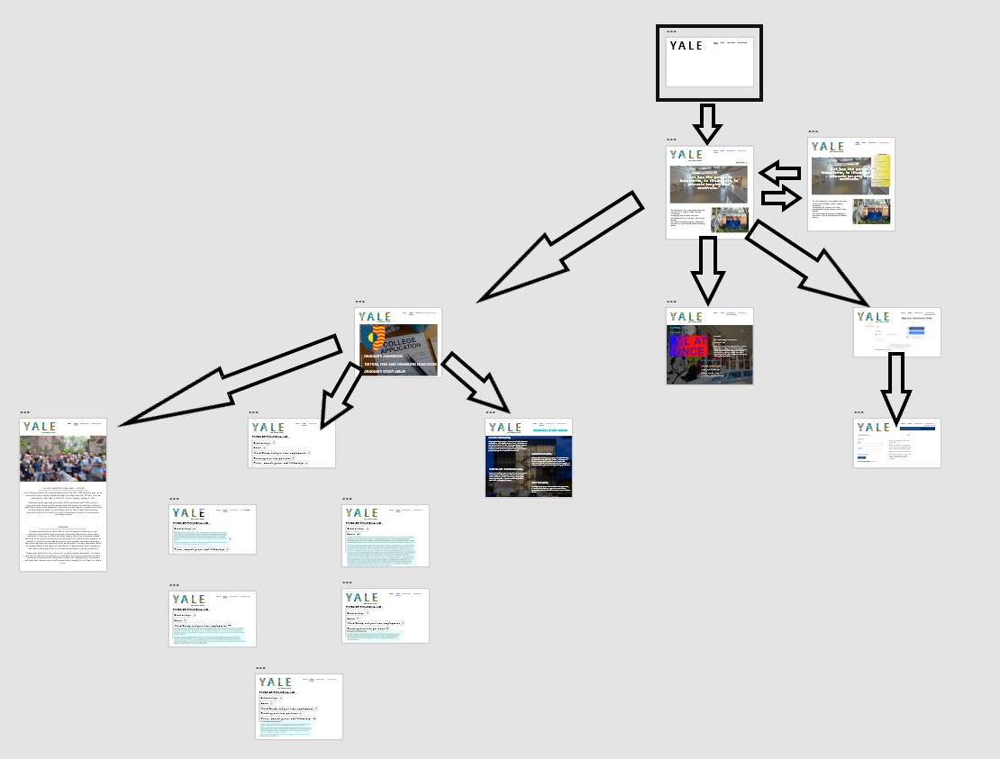

# DEVCLUB-ASSIGNMENT-PART-2
# YALE SCHOOL OF ART

## This is an Adobe XD UI redesign for the website https://www.art.yale.edu which is a website for the Yale School Of Art
## I redesigned this website due to its old fashioned  and messed up design, not following any material UI guidelines at all.

### Shown below is a flow chart of the Adobe XD file. 
### The starting point of the file is the top most page enclosed in a rectangle.
   

### Shown below is the home page, where the YALE icon has a beautiful changing background with each page swap. The home page also has a menu on the top-right corner to navigate through the website. Also present, is a quick links option on the right edge of the window.
   
   

